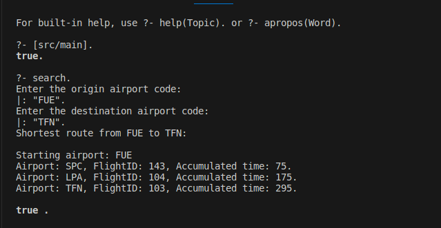

# Buscador de rutas en Prolog
[](https://github.com/jose-r-morera/Prolog_Air_Routes_Finder/blob/main/README.md)
[](https://opensource.org/licenses/Apache-2.0)
* **Autor**: José Ramón Morera Campos

Este proyecto fue desarrollado para la asignatura de Inteligencia Artificial del Grado en Ingeniería Informática de la Universidad de la Laguna.

La herramienta, creada con el lenguaje Prolog, permite seleccionar un aeropuerto de salida y otro de llegada, y realiza una búsqueda, mediante el algoritmo A*, de la ruta de menor duración, incluyendo rutas con escalas. En el caso de las escalas, se considera que sean factibles, es decir, los vuelos sean secuenciales temporalmente.

Este README sirve de resumen del proyecto, para información maś detallada se puede consultar el informe `report_es,pdf` en `/docs`.

## Estructura del Proyecto

```
├── data/  
│   ├── airports.pl     # Base de conocimiento de aeropuertos  
│   └── flights.pl      # Base de conocimiento de vuelos  
├── docs/  
│   └── report_es.pdf     # Informe detallado del proyecto 
│   └── report_en.pdf     # Informe en inglés
├── img/  
│   └── usage.png  
├── src/  
│   └── main.pl         # Código fuente principal  
└── README.md  
```
## Requisitos Previos
* Es necesario tener instalado [SWI-Prolog](https://www.swi-prolog.org/download/stable).

## Uso
1. Desde la terminal, navega hasta el directorio raíz de este proyecto.
2. Abrir swipl
3. Cargar el programa 
   ```prolog
   ?- ['src/main'].
   ``` 
4. Ejecuta la función principal:
   ```prolog
   ?- search.
   ```
5. Interactuar con el programa. Los aeropuertos se deben indicar mediante su código IATA. Debido a la sintaxis de Prolog, los códigos deben indicarse entre comillas dobles, y terminados en un punto.

### Ejemplos de uso
  
En este ejemplo se busca la ruta de menor duración entre Fuerteventura (FUE) y Tenerife Norte (TFN). Observamos que en la base de conocimiento de la que disponemos, esta ruta consiste en tomar 3 vuelos:

Un primer vuelo a Santa Cruz de La Palma (SPC) con duración de 75 minutos y código de vuelo 143. 

Un segundo vuelo desde La Palma hasta Las Palmas de Gran Canaria (LPA), con código de vuelo 104, llevando una duración de vuelo acumulada de 175 minutos.

Finalmente, un tercer vuelo desde Gran Canaria hasta Tenerife Norte, con ID 103 y alcanzando una duración total de viaje de 295 minutos. 


## Fuentes de datos
* **Aeropuertos**: el nombre, los códigos y las coordenadas de los aeropuertos de España, Francia y Alemania se han obtenido de la página web <https://openflights.org/data.php>.
* **Vuelos**: se han generado datos sintéticos utilizando LLMs, con el objetivo de lograr realismo.

## Detalles de implementación

### Algoritmo A*
El algoritmo A* se implementa de forma recursiva con la función `A_star`. Mientras la frontera (lista abierta) contiene nodos y el nodo actual no es el objetivo, se exploran los sucesores del nodo actual y se realiza una llamada recursiva con los nodos restantes.

- **Estructura del grafo:** Se utiliza un **multigrafo**, ya que cada aeropuerto (nodo) puede tener múltiples vuelos (aristas) hacia otro aeropuerto. Cada arista se representa como una tupla `[aeropuerto_destino, vuelo, coste_acumulado]`.
- **Generación de sucesores:** La función `findall` encuentra todos los nodos sucesores del nodo actual, considerando únicamente vuelos con horarios posteriores al vuelo actual.
- **Manejo de la frontera:** 
  - Se evita duplicar aeropuertos en la frontera usando `member`.  
  - Si un aeropuerto ya existe con un coste mayor, se reemplaza por el nodo con menor coste.  
  - La inserción es ordenada según $f(x) = g(x) + h(x)$ para garantizar que la cabeza de la frontera tenga siempre el menor coste estimado.

### Función heurística
- La heurística utilizada es la **distancia entre el aeropuerto actual y el destino**, calculada mediante la función `haversine` a partir de latitud y longitud de los aeropuertos.
- Se consideraron heurísticas alternativas, como el **nivel de conectividad** del aeropuerto, pero la calibración excedía el alcance del proyecto.

### Restricciones de vuelos
- Solo se consideran vuelos que comienzan **posteriormente al vuelo anterior**.  
- Las horas se almacenan como strings `HH:MM` y se comparan con el operador `@>`.

### Entrada / Salida
- Se utilizan los predicados Prolog `write()` y `read()` para la interacción con el usuario.  
- La entrada del usuario debe terminar en un punto, según el comportamiento de `read()`.  
- Para mostrar rutas de forma amigable, se emplea la función auxiliar `format/3` que permite construir cadenas con información de cada vuelo.

### Observaciones de implementación
- Se resolvieron problemas con la terminal insertando un salto de línea antes de la lectura de la entrada para evitar solapamiento de texto.  
- La actualización de nodos en la frontera requiere eliminar el nodo con mayor coste y luego insertar el nuevo de forma ordenada.  

## Oportunidades de mejora
* Mejora de la E/S: en vez de que se introduzca el aeropuerto, se podría introducir una provincia/región y listar todos los posibles aeropuertos, ya que esta información está en la base de conocimiento.
* Realización de múltiples búsquedas: actualmente se considera un único aeropuerto de partida y de llegada. Se podría permitir que se introduzca una región de partida (por ejemplo, Tenerife) 
* Considerar el tiempo pasado en los aeropuertos sin tomar vuelos (tiempo de escala) como parte del coste.
* Considerar el coste económico de los vuelos, de cara a ordenar posibles rutas, o usarlo como criterio de búsqueda.
* Mejora de la función heurística considerando más factores o factores distintos.

## Licencia

Copyright © 2023 - 2025, José Ramón Morera Campos.

Distribuido bajo la Licencia Apache, Versión 2.0. Consulta el fichero `LICENSE` para más detalles.
