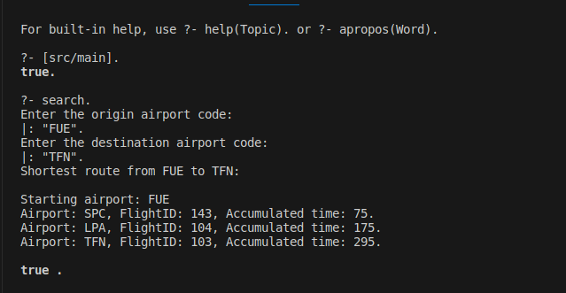

# Prolog Air Route Finder

* **Author**: José Ramón Morera Campos

This project was developed for the Artificial Intelligence course in the Computer Engineering Degree at the University of La Laguna.

The tool, created with the Prolog language, allows you to select a departure and an arrival airport, and performs a search using the A* algorithm to find the shortest-duration route, including routes with stopovers. In the case of stopovers, feasibility is considered, meaning flights must be sequential in time.

This README serves as a project summary; for more detailed information, see the report `report_en.pdf` in `/docs`.

## Project Structure

~~~
├── data/  
│   ├── airports.pl     # Knowledge base of airports  
│   └── flights.pl      # Knowledge base of flights  
├── docs/  
│   └── report.pdf      # Detailed project report  
├── img/  
│   └── usage.png  
├── src/  
│   └── main.pl         # Main source code  
└── README.md  
~~~

## Prerequisites
* You need to have [SWI-Prolog](https://www.swi-prolog.org/download/stable) installed.

## Usage
1. From the terminal, navigate to the root directory of this project.
2. Open `swipl`.
3. Load the program: 
   ~~~prolog
   ?- ['src/main'].
   ~~~ 
4. Run the main function:
   ~~~prolog
   ?- search.
   ~~~
5. Interact with the program. Airports must be entered using their IATA codes. Due to Prolog syntax, the codes must be enclosed in double quotes and end with a period.

### Usage examples
  
In this example, the program searches for the shortest route between Fuerteventura (FUE) and Tenerife North (TFN). In the available knowledge base, this route consists of taking 3 flights:

A first flight to Santa Cruz de La Palma (SPC), lasting 75 minutes, with flight code 143.  

A second flight from La Palma to Las Palmas de Gran Canaria (LPA), with flight code 104, resulting in a cumulative flight time of 175 minutes.  

Finally, a third flight from Gran Canaria to Tenerife North, with ID 103, reaching a total travel time of 295 minutes.  

## Data sources
* **Airports**: names, codes, and coordinates of airports in Spain, France, and Germany were obtained from <https://openflights.org/data.php>.
* **Flights**: synthetic data was generated using LLMs, aiming for realism.

## Implementation details

### A* Algorithm
The A* algorithm is implemented recursively with the `A_star` function. While the frontier (open list) contains nodes and the current node is not the goal, the successors of the current node are explored, and a recursive call is made with the remaining nodes.

- **Graph structure:** A **multigraph** is used, since each airport (node) can have multiple flights (edges) to another airport. Each edge is represented as a tuple `[destination_airport, flight, accumulated_cost]`.
- **Successor generation:** The `findall` function finds all successor nodes of the current node, considering only flights with schedules later than the current one.
- **Frontier management:**  
  - Duplicate airports in the frontier are avoided using `member`.  
  - If an airport already exists with a higher cost, it is replaced by the node with the lower cost.  
  - Insertion is ordered according to $f(x) = g(x) + h(x)$ to ensure the frontier head always has the lowest estimated cost.

### Heuristic function
- The heuristic used is the **distance between the current airport and the destination**, calculated with the `haversine` function from the airports’ latitude and longitude.  
- Alternative heuristics were considered, such as the **airport connectivity level**, but calibration exceeded the project’s scope.

### Flight constraints
- Only flights that **depart after the previous flight** are considered.  
- Times are stored as strings `HH:MM` and compared with the `@>` operator.

### Input / Output
- Prolog predicates `write()` and `read()` are used for user interaction.  
- User input must end with a period, according to `read()` behavior.  
- To display routes in a user-friendly way, the auxiliary function `format/3` is used to build strings with information about each flight.

### Implementation notes
- Terminal issues were resolved by inserting a newline before reading input to avoid text overlap.  
- Updating nodes in the frontier requires removing the node with the higher cost and then inserting the new one in order.  

## Improvement opportunities
* Input/Output improvement: instead of entering the airport directly, a province/region could be entered and all possible airports listed, since this information is in the knowledge base.  
* Multiple searches: currently only one departure and arrival airport are considered. It could be extended to allow entering a departure region (e.g., Tenerife).  
* Consider layover time at airports as part of the total cost.  
* Consider the economic cost of flights to sort possible routes, or use it as a search criterion.  
* Improve the heuristic function by considering more or different factors.  

## License

Copyright © 2023 - 2025, José Ramón Morera Campos.

Distributed under the Apache License, Version 2.0. See the `LICENSE` file for details.
